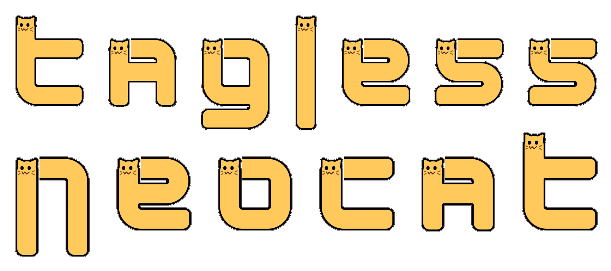

<h1 align="center">
	
</h1>

Tool to convert text to `:neocat_stretch:` emojis that you can use in the
[Hack Club Slack](https://slack.hackclub.com/). Made for
[Tagless](https://tagless.hackclub.com/).

## Demo

> [!TIP]
> Visit <https://ethmarks.github.io/tagless-neocat/>

## How it Works

### The font

All the real logic happens in [neocat.js](./neocat.js). Most of it was
~~stolen~~ adapted from
[Max Wofford's neocat utility](https://github.com/maxwofford/neocat).

Font definition:

1. Each tile emoji (e.g. `:neocat_stretch_3way_bottom_fixed:`) is assigned an
   abbreviation (e.g. `t3b`), because otherwise the code would be even more of
   an unreadable mess that it already is.
2. Each glyph (of which there are 45) is a 2D array of tiles. The tiles are
   chosen so that their shape resembles the character that the glyph represents.
3. The big `FONT` constant is a mapping of each character to its corresponding
   glyph.

Text to emojis:

1. The input text is split into characters, each of which is mapped onto its
   glyph (plus some extra logic to handle separators and unknown characters).
2. The glyphs are combined horizontally into rows.
3. All the tiles in each row are combined together
4. All the rows are combined together (separated by newlines)
5. The end result is one giant string that can be rendered in Slack!

Emojis to rendered HTML element:

1. The string is split by newlines to get the rows back
2. The rows are split by colons to get the tile names back
3. Each tile is used to generate an `img` tag
4. All the img tags in each row are appended to a `div`
5. All the rows are appended to one big `div`
6. The end result is one giant `HTMLElement` that can be injected into a page!

### The page

If you're familiar with
[Tagless Markdown](https://github.com/ethmarks/tagless-md) (my other project for
Tagless), the Tagless Neocat page works in basically the same way (fun fact:
Tagless Neocat actually uses Tagless Markdown in a few places).

[`index.html`](./index.html) is only a barebones shell whose entire job is to
import [`page.js`](./page.js), which does all of the heavy lifting by
manipulating the DOM using `.createElement()`.

## Acknowledgements

- Thanks to [Max Wofford](https://github.com/maxwofford) for making the
  [Neocat CLI](https://github.com/maxwofford/neocat). It's written in Go, so I
  had to manually transpile the glyph definition code from a Go map to a JS
  record.
- Thanks to [Volpeon](https://github.com/volpeon) for making
  [the original Neocat emojis](https://volpeon.ink/emojis/neocat/), which I used
  for the preview/render of the emojis. I sourced the emoji images from Max
  Wofford's repo, but he didn't give attribution, so I'm not entirely sure where
  he got them from. However, the original source is Volpeon, as far as I can
  tell.
- Thanks to [Mitesh](https://github.com/oxalorg) for making
  [Sakura](https://oxal.org/projects/sakura/), which I used for the site styles.

## License

This project is under an MIT License. See [LICENSE](./LICENSE) for more
information.
